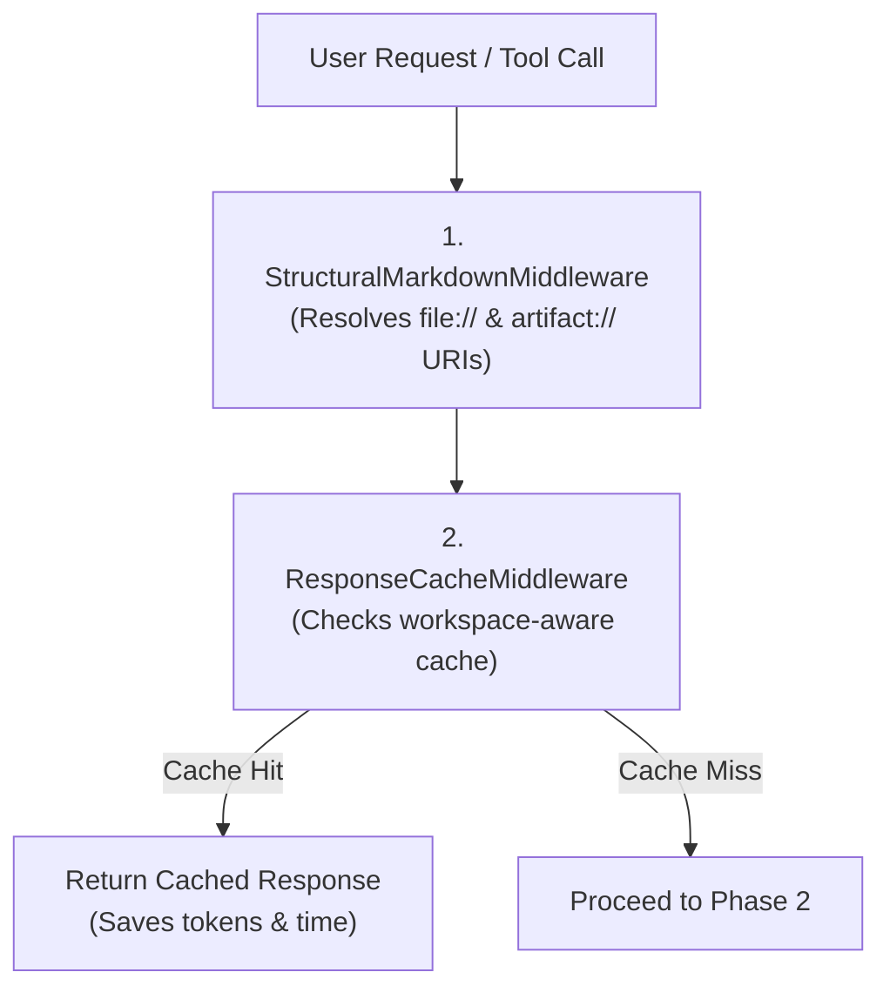
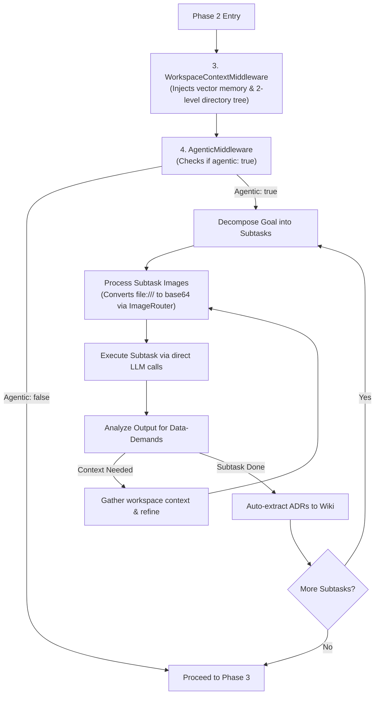
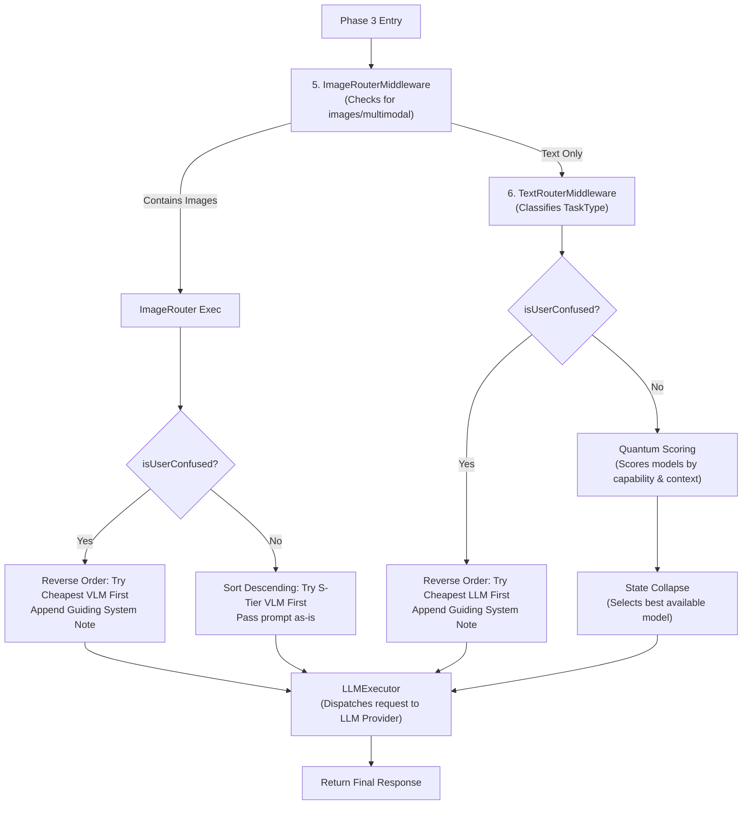
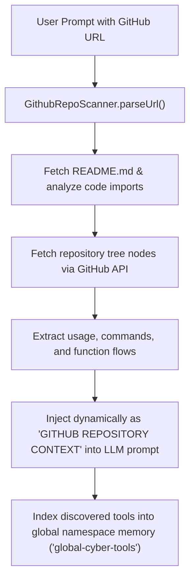
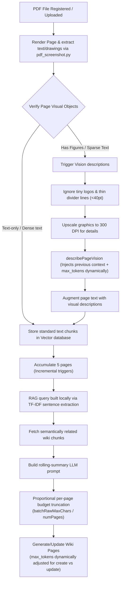

# Workflow & Architecture Guide

This guide explains the inner workings of the LLM Orchestration Pipeline, including routing logic, token management, and middleware execution.

---

## 1. Orchestration Pipeline Flow (v1.0.6 Update)

The system uses a middleware-based pipeline. Every request passes through a series of decoupled middleware layers before reaching the LLM provider.

### 🔄 Decoupled Pipeline Architecture (Phased Breakdown)
 
To make the pipeline execution easy to understand, it is broken down into three distinct phases:
 
#### Phase 1: Request & Cache Checking
In this phase, the server sanitizes the request and attempts to serve it from the local cache.
 

 
#### Phase 2: Context Gathering & Agentic Planning
If the cache misses, the server gathers workspace context and, if enabled, runs the agentic subtask execution loop.
 

 
* **Subtask Visual Grounding**: To support visual TDD, if a subtask prompt references local images or artifacts (e.g. `file:///path/to/screenshot.png`), `AgenticMiddleware` automatically invokes `ImageRouterMiddleware`'s processing engine to convert the URLs to base64 before calling the LLM executor.
* **Vision Model Prioritization**: When executing an image-bearing subtask, `LLMExecutor` automatically detects the image payload and **prioritizes vision-capable models** (such as `gemini-3.1-flash-lite` or `google/gemma-4-31b-it:free`) to prevent routing failures to text-only models.
 
---
 
#### Phase 3: Routing & LLM Execution
Finally, the request is routed depending on whether it contains images, scored using the quantum router, and dispatched to the LLM. If a confused user state is detected, fallback trial ordering is reversed and a guiding system note is appended — this no longer affects indexing (see note below).
 

### Pipeline Order (v1.0.7 Update)
1. **`StructuralMarkdownMiddleware`**: Resolves `file://` and `artifact://` URIs with security boundary checks.
2. **`ResponseCacheMiddleware`**: Checks if a result exists in the persistent workspace-aware cache.
3. **`WorkspaceContextMiddleware`**: Injects vector-searched memory and system prompts. Backgrounds (via `setImmediate`, non-blocking) a pre-emptive workspace re-index followed by wiki maintenance, gated on `agentic: true` + a `workspace_root`. **Bypassed only if the caller sets `skipIndexing: true` on the request itself** — see note below.
4. **`AgenticMiddleware`**: Decomposes tasks into subtasks and manages execution loops.
5. **`ImageRouterMiddleware`**: Intercepts local/remote image files, checks for confused/empty prompts (image-only), reverses model trial order to save token budget, and appends a guiding system note.
6. **`TextRouterMiddleware`**: Routes text prompts. Reverses model trial order and appends a guiding system note for file-only/generic confused queries.

> [!NOTE]
> **`skipIndexing` is caller-set only.** `WorkspaceContextMiddleware` runs *before* `AgenticMiddleware`/`ImageRouterMiddleware`/`TextRouterMiddleware` in the pipeline and reads `skipIndexing` before calling `next()`, so none of those downstream middlewares can set it in time to have any effect — it must already be `true` on the incoming request (see `use_free_llm`'s `skipIndexing` parameter in `SKILL.md`). Earlier versions had the confused-user branches in `ImageRouterMiddleware`/`TextRouterMiddleware` also set this flag; that was dead code (set too late to matter) and was removed. PDF/image content reaching the workspace wiki is unaffected either way — see §8, which runs independently of this gate.

---

## 2. Quantum-Inspired Routing & Model Scoring

The `TextRouterMiddleware` uses a **probabilistic quantum scoring matrix** instead of static model routing. It treats model selection as a state vector that collapses based on real-time telemetry and task constraints.

### Task-Based Model Mapping
The centralized `TaskClassifier` dynamically classifies the request into a `TaskType` and collapses the routing state to the optimal model tier:

* **Coding**: `qwen/qwen3-coder-480b-a35b:free` -> `gemini-3.1-flash-lite`
* **Reasoning**: `deepseek/deepseek-r1` -> `nvidia/nemotron-3-ultra-550b-a55b`
* **Search / Summarization**: `gemini-3.1-flash-lite` -> `cohere/command-r-plus`
* **Chat / General**: `meta-llama/llama-3.3-70b-instruct`

### State Collapse & Telemetry
1. **Scoring**: Each model is scored based on the classified `TaskType`.
2. **Modifiers**: Real-time RPM/RPD quotas and latency averages (from `get_token_stats`) modify the scores.
3. **Collapse**: The system sorts models by collapse probability and sequentially attempts execution, falling back instantly if a provider fails.

### Centralized Task Classifier
The `TaskClassifier` uses single-pass regex heuristics with word boundaries (`\b`) and a keyword weighting map (`keywordTaskMap`) to classify the task type in under 0.05ms, preventing any overhead.ad.

---

## 3. Token Management & Synchronization

The pipeline maintains a local "interpolated" token count to prevent overwhelming providers and hitting hard limits. Token management is handled by the `LLMExecutor` utility class, which is called directly by the router during fallback attempts.

### Token Management Flow
1. **Local Estimation**: Before a request, `js-tiktoken` estimates the input tokens.
2. **Proactive Blocking**: If the estimated usage exceeds the remaining quota, the request is blocked or routed elsewhere.
3. **Provider Execution**: `LLMExecutor.tryProvider()` combines token checks + API call in one atomic operation.
4. **Response Sync**: After a successful call, the executor reads `x-ratelimit-remaining-tokens` headers to update the ground truth.

---

## 4. MCP Tools Interaction

The server exposes public tools for LLM interaction, discovery, and workspace management:

### 1. `use_free_llm`
Universal chat interface with automatic fallback cascade through 70+ free models.

### 2. `execute_skill` [NEW]
Runs a prompt grounded in a specific skill's instructions. Resolves the skill directory, parses relative file paths in `SKILL.md` (e.g. `references/`, `resources/`), loads their contents, and injects them as system context.

### 3. `vision_tool` [NEW]
Processes local or remote image files, converting them to base64 and routing them to available vision providers.

### 4. `manage_memory`
Interface for the persistent, workspace-aware memory system.
- **Actions**: `search`, `list`, `stats`, `clear`.

### 5. `store_workspace_skill` & `index_workspace`
- **`store_workspace_skill`**: Explicitly save structured research and decisions following the `@skill-writer` schema.
- **`index_workspace`**: Proactively index all workspace files into the vector database for high-fidelity semantic recall.

---

## 5. Agentic Middleware & State Management

The optional **Agentic Middleware** (`src/pipeline/middlewares/AgenticMiddleware.ts`) adds a structured, self-improving execution layer on top of the existing pipeline.

### Relevance of the `agentic` Flag
*   **`agentic: false` (One-Pass, default)**: Bypasses the subtask queue decomposition entirely. The request is processed as a standard one-shot chat message, saving tokens and processing time for straightforward requests.
*   **`agentic: true` (Multi-Step queue loop)**: Decomposes the user's prompt into discrete subtasks. It seeds momentum queues and runs a verification check loop after each subtask, allowing the agent to self-correct and execute long-running features.

| Feature | Description |
|---------|-------------|
| **System Prompt Injection** | Prepends the tailored system prompt to every request, loaded dynamically via `getIntelligentSystemPrompt()`. |
| **Task Decomposition** | Splits the user goal into discrete steps and seeds the `nowQueue`. |
| **Momentum Queues** | In-memory `nowQueue`, `nextQueue`, `blockedQueue`, and `improveQueue` per session, persisted to `projects/{sessionId}/queues.json`. |
| **File-First State** | Creates `projects/{sessionId}/plan.md`, `tasks.md`, and `knowledge.md` on first use. |
| **Verification Loop** | After each step, performs a self-check LLM call. Failed verifications are enqueued to `improveQueue`. |

### Enabling the middleware
You can opt-in on a per-call basis by passing `"agentic": true` in the request body along with a **`workspace_root`** or **`sessionId`**.

---

## 6. Context Injection & GitHub Repository Scanner

`WorkspaceContextMiddleware` automatically gathers and injects rich structural context into the LLM prompt.

### 🌐 Context Injection Types
1.  **Semantic Search (RAG)**: Searches the vector store for document chunks matching the user's prompt keywords.
2.  **Directory Structure**: Injects a 2-level directory tree of the active workspace.
3.  **Active File Contexts**: Extracts open files and cursor placements.
4.  **Code Symbol Hierarchies**: Maps classes, functions, and import dependencies.

### 🐙 GitHub Repository Scanner
If a user prompt contains a public GitHub URL (e.g., `https://github.com/owner/repo`), the `WorkspaceContextMiddleware` automatically triggers the **`GithubRepoScanner`** to pull remote context dynamically:

---

## 7. Firebase for debugging and telemetry

The firebase integration is used for telemetry and debugging purposes. It collects anonymized usage data, error logs, and performance metrics to help improve the system. You can view the collected data in the Firebase console. 

You can disable Firebase telemetry by setting `FIREBASE_API_KEY` to an empty string in the `.env` file. The server will then skip telemetry initialization and logging. 

---

## 8. PDF-Wiki RAG & Vision Indexing Pipeline (v1.0.7)

To support semantic search and indexing over complex document types, the system implements an incremental **PDF-Wiki RAG Pipeline** equipped with high-DPI visual rendering, layout heuristics, and dynamic token allocations.

> [!NOTE]
> This pipeline fires fire-and-forget from `resolvePdfRef()` on every `pdf://` reference, keyed by `workspaceRoot` → `wsHash`. It is completely independent of `agentic`, `WorkspaceContextMiddleware`'s indexing gate, and `skipIndexing` — a plain one-shot `pdf://` request (no `agentic: true`, no `workspace_root` re-indexing) still gets indexed into the wiki.

### 🔄 Incremental PDF Indexing Flow

### 📊 Token Budget Adjustments

1.  **Per-Page Proportional Budget**: When batch text exceeds maximum bounds, the budget is split equally across pages (`batchRawMaxChars / numPages`) rather than front-loading page 1 and dropping later pages.
2.  **Dynamic Vision Tokens**:
    *   Full-page sweeps: `500` tokens on the first pass (for primary layout schema), `300` tokens on delta passes.
    *   Sub-block cropped images: Scaled between `100` and `200` tokens based on region area.
3.  **Dynamic Wiki Update Tokens**: Creation passes start at a base of `2400` tokens, update passes start at `1400` tokens, plus a `80` token batch bonus and a summary length retention floor.

---

## 9. File Lock Safety (v1.0.7)

To prevent corruption and race conditions during concurrent workspace indexing or database writes, the system employs process-safe **exclusive file locking** (`src/utils/file-lock.ts`).

### 🔒 Exclusion & Recovery Mechanics

*   **Atomic Lock Creation**: Locks are acquired via atomic file writing (`flag: 'wx'`) recording the active process PID.
*   **Automatic Stale Reaping**: If a lock is requested but already held, the system attempts to reap it if:
    1.  The recorded holder PID is no longer alive in the OS.
    2.  The lock file age (`mtime`) exceeds the `STALE_LOCK_MS` (30 seconds) timeout.
*   **Timeout & Retries**: Requests poll every 50ms and throw a timeout error if the lock cannot be acquired within `timeoutMs`.
